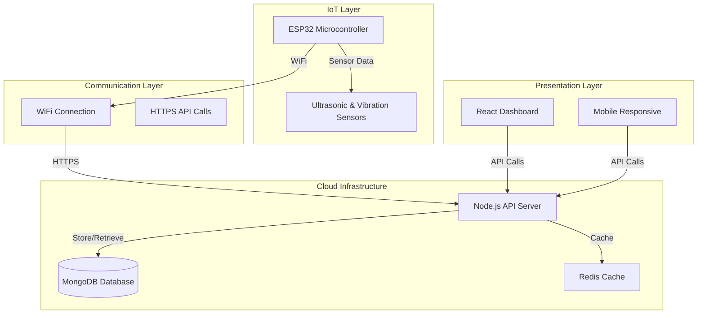

# 🚰 Smart Borehole Monitoring System (SBMS)

<div align="center">

[](https://opensource.org/licenses/MIT)
[](https://nodejs.org/)
[](https://reactjs.org/)
[](https://mongodb.com/)
[](https://azure.microsoft.com/)

**An IoT-powered platform for real-time monitoring and management of rural borehole water systems**

[📖 Documentation](#-documentation) • [🚀 Quick Start](#-quick-start) • [🔧 API Reference](#-api-reference) • [🤝 Contributing](#-contributing)

</div>

## 📋 Table of Contents

- [Overview](#-overview)
- [Features](#-features)
- [System Architecture](#-system-architecture)
- [Tech Stack](#-tech-stack)
- [Getting Started](#-getting-started)
- [Installation](#-installation)
- [Configuration](#-configuration)
- [Usage](#-usage)
- [API Documentation](#-api-documentation)
- [Deployment](#-deployment)
- [Contributing](#-contributing)
- [License](#-license)

## 🎯 Overview

The **Smart Borehole Monitoring System (SBMS)** is a comprehensive IoT solution designed to address water management challenges in rural communities. By leveraging real-time sensor data and predictive analytics, SBMS ensures sustainable water resource management, prevents equipment failures, and enables proactive maintenance of borehole systems.

### Key Benefits
- **Prevent Pump Failures**: Early detection through vibration and performance monitoring
- **Optimize Water Usage**: Data-driven insights for efficient resource allocation
- **Reduce Maintenance Costs**: Predictive maintenance scheduling
- **Remote Monitoring**: Real-time access from anywhere via web dashboard
- **Community Empowerment**: Transparent water management for rural communities

## ✨ Features

### 🔍 Real-Time Monitoring
- **Water Level Tracking**: Ultrasonic sensor monitoring with 1-minute intervals
- **Pump Status Monitoring**: On/off state, runtime hours, and performance metrics
- **Vibration Analysis**: 3-axis accelerometer data for pump health assessment
- **Connectivity Status**: Network strength and device online/offline tracking

### 📊 Data Analytics
- **Historical Trends**: 30-day rolling data with customizable date ranges
- **Usage Analytics**: Daily, weekly, and monthly consumption patterns
- **Predictive Insights**: ML-powered failure prediction (coming soon)
- **Export Capabilities**: CSV/JSON data export for external analysis

### 🚨 Smart Alerts
- **Multi-channel Notifications**: Email, SMS, and dashboard alerts
- **Configurable Thresholds**: Customizable alert parameters per site
- **Alert History**: Complete audit trail of all system notifications
- **Escalation Rules**: Automatic escalation for critical issues

### 👥 User Management
- **Role-based Access Control**: Admin, Technician, and Viewer roles
- **Multi-site Management**: Single dashboard for multiple boreholes
- **Audit Logging**: Complete user activity tracking
- **Team Collaboration**: Shared maintenance schedules and notes

## 🏗️ System Architecture



## 🛠️ Tech Stack

### Backend
- **Runtime**: Node.js 18.x LTS
- **Framework**: Express.js
- **Database**: MongoDB 6.x with Mongoose ODM
- **Authentication**: JWT with refresh tokens
- **Validation**: Joi schema validation
- **Security**: Helmet, CORS, rate limiting
- **Testing**: Jest & Supertest

### Frontend
- **Framework**: React 18.x with TypeScript
- **Styling**: Tailwind CSS + Shadcn/ui
- **State Management**: React Context + Zustand
- **Charts**: Recharts for data visualization
- **Forms**: React Hook Form + Zod
- **HTTP Client**: Axios with interceptors

### IoT Hardware
- **Microcontroller**: ESP32-WROOM-32
- **Sensors**: 
  - HC-SR04 Ultrasonic Sensor (Water level)
  - ADXL345 3-axis Accelerometer (Vibration)
- **Communication**: WiFi 802.11 b/g/n
- **Power**: 5V DC adapter with battery backup

### Infrastructure
- **Cloud Platform**: Microsoft Azure
- **Frontend Hosting**: Azure Static Web Apps
- **Backend Hosting**: Azure App Service
- **Database**: Azure Cosmos DB (MongoDB API)
- **CI/CD**: GitHub Actions

## 🚀 Quick Start

### Prerequisites
- Node.js 18.x or higher
- MongoDB 6.x or higher
- Git
- Azure CLI (for deployment)

### 1. Clone the Repository
```bash
git clone https://github.com/Liwei254/HydroSmart.git
cd HydroSmart
```

### 2. Backend Setup
```bash
cd backend
npm install

# Create .env file
cp .env.example .env
# Edit .env with your configuration
```

### 3. Frontend Setup
```bash
cd frontend_new
npm install

# Create environment file
cp .env.example .env.local
# Edit .env.local with your backend URL
```

### 4. Start Development Servers
```bash
# Terminal 1 - Backend
cd backend
npm run dev

# Terminal 2 - Frontend
cd frontend_new
npm run dev
```

## ⚙️ Configuration

### Environment Variables

#### Backend (.env)
```env
# Server Configuration
PORT=5000
NODE_ENV=development

# Database
MONGO_URI=mongodb://localhost:27017/sbms

# Authentication
JWT_SECRET=your-super-secret-jwt-key
JWT_EXPIRE=7d

# IoT Configuration
ALLOWED_ARDUINO_IP=192.168.1.100
ARDUINO_JWT=your-arduino-specific-jwt

# Email (Optional)
SMTP_HOST=smtp.gmail.com
SMTP_PORT=587
SMTP_USER=your-email@gmail.com
SMTP_PASS=your-app-password

# SMS (Optional)
TWILIO_SID=your-twilio-sid
TWILIO_AUTH_TOKEN=your-twilio-auth-token
TWILIO_PHONE=+1234567890
```

#### Frontend (.env.local)
```env
VITE_API_BASE_URL=http://localhost:5000/api
VITE_APP_NAME=SBMS
```

## 📖 API Documentation

### Base URL
```
http://localhost:5000/api
```

### Authentication Endpoints
| Method | Endpoint | Description |
|--------|----------|-------------|
| POST | `/auth/register` | Register new user |
| POST | `/auth/login` | User login |
| POST | `/auth/logout` | User logout |
| POST | `/auth/refresh` | Refresh JWT token |

### Sensor Data Endpoints
| Method | Endpoint | Description |
|--------|----------|-------------|
| GET | `/sensor-data` | Get all sensor readings |
| GET | `/sensor-data/latest` | Get latest reading |
| POST | `/sensor-data` | Add new sensor data (IoT devices) |
| GET | `/sensor-data/stats` | Get statistical data |

### Alert Endpoints
| Method | Endpoint | Description |
|--------|----------|-------------|
| GET | `/alerts` | Get all alerts |
| POST | `/alerts` | Create new alert |
| PUT | `/alerts/:id` | Update alert status |
| DELETE | `/alerts/:id` | Delete alert |

For complete API documentation, visit: [API Docs](http://localhost:5000/api-docs)

## 🧪 Testing

### BackendI've read the current README content for the Smart Borehole Monitoring System (SBMS). Now, I will create a comprehensive plan for enhancing the README, ensuring it covers all necessary aspects of the project.

### Plan for README Enhancement

1. **Overview**: Retain the existing overview, as it succinctly describes the purpose and benefits of the SBMS.

2. **Features**: Keep the current features section, but consider adding more details or examples for each feature to enhance clarity.

3. **System Architecture**: Add a diagram or description of the system architecture to provide a visual representation of how components interact.

4. **Technologies Used**: This section is well-structured. Ensure that all technologies are up-to-date and consider adding links to documentation for each technology.

5. **Getting Started**: 
   - Ensure the instructions are clear and easy to follow.
   - Add a section for environment setup, including any prerequisites (e.g., Node.js version, MongoDB setup).
   - Include a troubleshooting section for common issues during setup.

6. **Contributing**: Add a section on how others can contribute to the project, including guidelines for submitting issues and pull requests.

7. **License**: Include a section for the project's license to clarify usage rights.

8. **Contact Information**: Provide contact information for users to reach out for support or inquiries.

### Dependent Files to be Edited
- `README.md`: This is the primary file to be updated.

### Follow-Up Steps
- Update the README with the new content.
- Review the changes for clarity and completeness.
- Commit the changes to the repository.

Now, I will proceed to update the README file with the enhanced content. 

<create_file>
<path>README.md</path>
<content>
# Smart Borehole Monitoring System (SBMS)

## Overview
The **Smart Borehole Monitoring System (SBMS)** is an IoT-powered platform for **real-time monitoring, control, and analysis** of rural borehole water systems. Designed to ensure **efficient water management**, it helps prevent pump failures, optimize water usage, and facilitate proactive maintenance, especially in **rural communities**.

## 🌐 Features
- 📊 **Real-Time Data Visualization**: Monitor water level, pump status, vibration, and connectivity in real-time.
- 📈 **Historical Trends & Analytics**: Analyze usage patterns, water levels, and vibrations over time.
- 🚨 **Alerting System**: Receive alerts for pump issues, low water levels, and sensor failures.
- 🛠️ **Maintenance Logging**: Keep track of maintenance activities and schedules.
- 🔐 **User Roles & Permissions**: Manage access with roles for Admin, Technician, and Viewer.
- 🌎 **Remote IoT Data Integration**: Seamlessly integrate data from ESP32 microcontrollers.
- 💾 **MongoDB Data Storage**: Store sensor data, alerts, and maintenance logs securely.
- 🔐 **JWT-Based Secure API Authentication**: Ensure secure access to the API.

## 🏗️ System Architecture
 <!-- Add a link to the architecture diagram -->

## 🛠️ Technologies Used

| Component           | Technology                               |
|---------------------|------------------------------------------|
| IoT Hardware        | ESP32 Microcontroller, Ultrasonic Sensor, Vibration Sensor |
| Backend API         | Node.js, Express.js, JWT Auth            |
| Database            | MongoDB (Mongoose ODM)                   |
| Frontend Dashboard  | React, TypeScript, Tailwind CSS          |
| Hosting (Frontend)  | Azure Static Web Apps                    |
| Hosting (Backend)   | Azure App Service                        |

## 🚀 Getting Started

### 1. Clone the Repository
```bash
git clone "https://github.com/Liwei254/HydroSmart.git"
cd sbms
```

### 2. Set Up the Backend
```bash
cd backend
npm install
PORT=5000
MONGO_URI=your_mongodb_connection_string
JWT_SECRET=your_jwt_secret
ALLOWED_ARDUINO_IP=192.168.xxx.xxx
ARDUINO_JWT=eyJhbGciOiJI...
npm start
```

### 3. Set Up the Frontend
```bash
cd frontend
npm install
const instance = axios.create({
  baseURL: 'http://192.168.xxx.xxx:5000/api', // Backend IP
});
npm run dev
```

### 4. Configure Arduino
```cpp
const char* ssid = "Your_WiFi_Name";
const char* password = "Your_WiFi_Password";

String backendURL = "http://192.168.xxx.xxx:5000/api/sensor-data";
String authToken = "Bearer eyJhbGciOiJIUz...";  // Arduino JWT
```

## 🤝 Contributing
We welcome contributions! Please read our [CONTRIBUTING.md](link_to_contributing) for guidelines on how to contribute to this project.

## 📄 License
This project is licensed under the MIT License. See the [LICENSE](link_to_license) file for details.

## 📞 Contact Information
For support or inquiries, please contact [Your Name](your_email@example.com).
